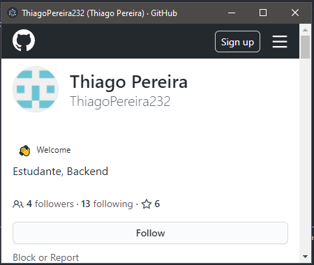

<h1 align="center">
    <p>Simple WebView com electron</p>
</h1>

# :clipboard: Índice

- [Sobre](#sobre)
- [Preview](#preview)
- [Tecnologias Utilizadas](#tecnologias-utilizadas)
- [Como Executar o Projeto](#executar)
- [License](#license)

---

<a id="sobre">

# :computer: Sobre

Um Webview feito em electron, que fica sempre sobre todos os programas na tela. Ideal para rodar uma página HTML durante o desenvolvimento, ou só para assistir alguma coisas enquanto faz outras.

---

<a id="preview">

# :tv: Preview

<div align="center">
    
</div>

---

<a id="tecnologias-utilizadas">

# :cd: Tecnologias utilizadas

O WebView utiliza as tecnologias:

- JavaScript
- ElectronJS
- HTML

---
 
<a id="executar">

# :computer: Como Executar o projeto

```bash
    # Clonar o repositório
    git clone https://github.com/ThiagoPereira232/webview-simple-electron

    # Entrar no projeto
    cd webview-simple-electron

    # Baixar as dependências
    npm install e

    # Executar o server
    npm start
```

---

<a id="contribuir"></a>

## :recycle: Como contribuir

- Faça um Fork desse projeto
- Crie uma branch
- Commit suas mudanças
- Push a sua Branch
- Crie um Pull Request

---


<a id="license"><a>

## :memo: License

Esse projeto está sob a licença MIT. Veja o arquivo [LICENSE](LICENSE) para mais detalhes.

---

<p align="center">
    Desenvolvido com 💜 por Thiago Pereira
</p>
